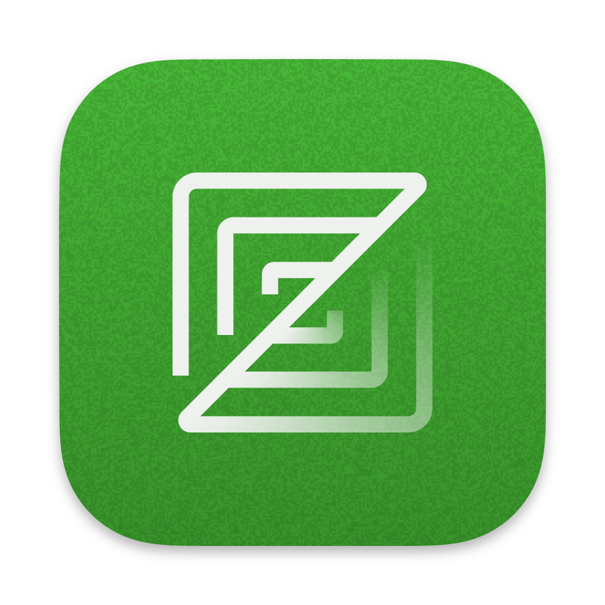

# Zed Extension for Vicinae

A powerful companion extension for the [Zed](https://zed.dev) code editor that integrates seamlessly with the Vicinae launcher. Browse, search, and manage your Zed projects directly from Vicinae with advanced features like project pinning, git branch display, and clipboard integration.



## ✨ Features

### 🔍 Project Discovery

- **Automatic project detection** from Zed's database
- **Real-time search** through all your Zed workspaces
- **Recent projects** with last opened timestamps
- **Remote project support** for SSH connections

### 📌 Project Management

- **Pin favorite projects** for quick access
- **Reorder pinned projects** with keyboard shortcuts
- **Remove projects** from recent history
- **Bulk operations** for managing multiple projects

### 🖥️ Opening Options

- **Open in existing Zed window** or **new window**
- **Clipboard integration** - open files directly from copied paths
- **File URL support** - handles `file://` URLs automatically
- **Path validation** with user-friendly error messages

### 🎨 User Experience

- **Git branch display** for projects with active branches
- **Project type indicators** with appropriate icons
- **Keyboard shortcuts** for power users
- **Loading states** and error handling
- **Responsive design** that works on all screen sizes

## 🚀 Installation

### Prerequisites

- [Vicinae](https://docs.vicinae.com/) launcher installed
- [Zed](https://zed.dev) code editor installed
- SQLite3 (usually pre-installed on most systems)

### Install Extension

```bash
# Clone or download the extension
git clone <repository-url>
cd zed-extension

# Install dependencies
npm install

# Build the extension
npm run build
```

The extension will be automatically installed to your Vicinae extensions directory.

## 📖 Usage

### Search Zed Projects

1. Open Vicinae
2. Type "Zed Projects" or use the assigned hotkey
3. Browse your recent Zed workspaces
4. Search by project name or path
5. Select a project to open in Zed

### Pin Favorite Projects

- **Pin**: Select a project → Actions → "Pin Entry" (`Ctrl+Shift+P`)
- **Unpin**: Select pinned project → Actions → "Unpin Entry" (`Ctrl+Shift+P`)
- **Reorder**: Use "Move Up" (`Ctrl+Shift+↑`) and "Move Down" (`Ctrl+Shift+↓`)

### Open from Clipboard

1. Copy a file path or `file://` URL to clipboard
2. Use "Open in Zed Editor" command
3. File opens in Zed (creates new file if path doesn't exist)

### Keyboard Shortcuts

| Action                   | Shortcut       |
| ------------------------ | -------------- |
| Pin/Unpin Project        | `Ctrl+Shift+P` |
| Move Pinned Project Up   | `Ctrl+Shift+↑` |
| Move Pinned Project Down | `Ctrl+Shift+↓` |
| Remove Project           | `Ctrl+X`       |
| Remove All Projects      | `Ctrl+Shift+X` |

## 🛠️ Commands

### Zed Projects (Main Interface)

- **Name**: `search`
- **Title**: Zed Projects
- **Description**: Browse and manage Zed editor projects
- **Mode**: View (interactive interface)

### Open in Zed Editor

- **Name**: `open`
- **Title**: Open in Zed Editor
- **Description**: Open clipboard content in Zed
- **Mode**: No-view (background operation)

### Open in New Window

- **Name**: `open-new-window`
- **Title**: Open in New Window
- **Description**: Open clipboard content in new Zed window
- **Mode**: No-view (background operation)

## ⚙️ Configuration

### Automatic Detection

The extension automatically detects:

- Zed installation location
- Zed database path
- Database version compatibility

### Manual Configuration

If automatic detection fails, you can modify paths in `src/lib/config.ts`:

```typescript
export const ZED_PATHS = {
  executable: [
    "/custom/path/to/zed",
    // ... other paths
  ],
  database: [
    "/custom/path/to/zed/db/0-stable/db.sqlite",
    // ... other paths
  ],
};
```

### Database Compatibility

- **Supported**: Zed 0.130+ (database version 28+)
- **Legacy**: Older Zed versions may have limited functionality
- **Auto-detection**: Extension detects and adapts to your Zed version

## 🔧 Troubleshooting

### Extension Not Loading

**Problem**: "Zed Projects" command not appearing in Vicinae

**Solutions**:

1. Ensure Zed is installed and accessible
2. Check that the extension built successfully: `npm run build`
3. Restart Vicinae after installation
4. Verify database permissions: `ls -la ~/.local/share/zed/db/`

### No Projects Showing

**Problem**: Empty project list despite having Zed workspaces

**Solutions**:

1. Open some projects in Zed first
2. Check database access: `sqlite3 ~/.local/share/zed/db/0-stable/db.sqlite "SELECT COUNT(*) FROM workspaces;"`
3. Verify Zed version compatibility
4. Check extension logs for database errors

### Clipboard Commands Failing

**Problem**: "Open in Zed Editor" shows validation errors

**Common Issues**:

- **Empty clipboard**: Copy a file path first
- **Invalid path**: Use absolute paths like `/home/user/file.txt` or `~/file.txt`
- **Non-existent path**: Extension will warn but still attempt to open

### Permission Errors

**Problem**: Database access denied

**Solutions**:

```bash
# Fix database permissions
chmod 644 ~/.local/share/zed/db/0-stable/db.sqlite

# Or reinstall Zed to fix permissions
```

### Zed Not Found

**Problem**: Extension can't locate Zed executable

**Solutions**:

1. Ensure Zed is in PATH: `which zed`
2. Or update path in `src/lib/config.ts`
3. Rebuild extension: `npm run build`

## 🏗️ Development

### Setup Development Environment

```bash
# Install dependencies
npm install

# Start development mode
npm run dev

# Build for production
npm run build

# Lint code
npm run lint

# Format code
npm run format
```

### Project Structure

```
src/
├── components/           # React components
│   ├── error-boundary.tsx    # Error handling
│   ├── entry-item.tsx        # Project list items
│   └── with-zed.tsx          # Zed context provider
├── hooks/                   # Custom React hooks
│   ├── use-pinned-entries.ts # Pinned projects management
│   └── use-recent-workspaces.ts # Workspace data fetching
├── lib/                     # Core business logic
│   ├── index.ts            # Barrel exports
│   ├── config.ts           # Configuration constants
│   ├── logger.ts           # Structured logging
│   ├── utils.ts            # Utility functions
│   ├── db.ts               # Database operations
│   ├── workspaces.ts       # Workspace type definitions
│   ├── entry.ts            # Entry transformations
│   ├── git.ts              # Git operations
│   └── repositories/       # Data access layer
│       └── workspace-repository.ts
├── open.ts                 # Clipboard open command
├── open-new-window.ts      # New window command
└── search.tsx              # Main search interface
```

### Code Style Guidelines

- **TypeScript**: Strict mode enabled
- **JSX**: React with react-jsx transform
- **Formatting**: Biome (no semicolons)
- **Imports**: Named imports, barrel exports
- **Naming**: PascalCase for types, camelCase for variables

### Architecture Patterns

- **Repository Pattern**: Clean data access separation
- **Error Boundaries**: React crash prevention
- **Structured Logging**: Consistent debugging
- **Configuration Management**: Centralized settings

## 🤝 Contributing

### Development Workflow

1. Fork the repository
2. Create a feature branch: `git checkout -b feature/your-feature`
3. Make your changes following the code style guidelines
4. Add tests for new functionality
5. Ensure all tests pass: `npm test`
6. Format code: `npm run format`
7. Lint code: `npm run lint`
8. Submit a pull request

### Code Quality

- Follow TypeScript strict mode guidelines
- Add JSDoc comments for public APIs
- Write comprehensive tests
- Ensure accessibility compliance
- Follow React best practices

## 📄 License

This project is licensed under the MIT License - see the [LICENSE](LICENSE) file for details.

## 🙏 Acknowledgments

- [Zed](https://zed.dev) - The amazing code editor this extension enhances
- [Vicinae](https://docs.vicinae.com/) - The launcher platform powering this extension
- The open source community for inspiration and tools
